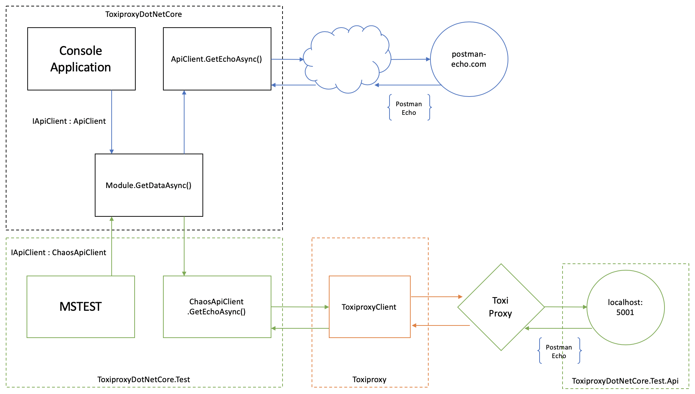

# .Net Core Toxiproxy Test Automation
This repo provides test automation examples using shopify/toxiproxy to create network level chaos and ensure services are able to handle various connectivity problems. The test automation is written in .net core and runs across various platforms. The intention of this repo is a best practice reference to use as a pattern to setup test automation for applications and APIs that rely on network connectivity for HTTP Rest API calls.

## Prerequisites
The following prerequisites are required to run the projects in this repo.

1. [Microsoft .net core](https://dotnet.microsoft.com/download)
2. [Install Toxiproxy](https://github.com/Shopify/toxiproxy#1-installing-toxiproxy) (additional instructions below)
3. [IDE (vscode recommended)](https://code.visualstudio.com/download)
4. [Docker](https://www.docker.com/get-started) (if using docker containers to host toxiproxy)

## Getting Started
To get started with toxiproxy and this repo go through the following steps:

1. Get toxiproxy running in a docker container or a local service (see instructions below)
2. Run an instance of the ToxiproxyDotNetCore.Test.Api web api from a terminal or command line prompt

```
cd  ToxiproxyDotnetCore.Test.Api
dotnet run
```

3. Run an instance of toxiproxy server

*from a terminal or command line prompt:*
```
toxiproxy-server
```

*from a docker container:*
```
docker run --name=toxiproxy --net=host --rm --expose 8080 -p 8080:8080 --expose 8474 -p 8474:8474 -it shopify/toxiproxy
docker exec -it toxiproxy /bin/sh
```

4. Test toxiproxy functionality with the following commands

```
toxiproxy-cli create example -l 127.0.0.1:8080 -u postman-echo.com:80
curl -v --location --request GET "127.0.0.1:8080/get?foo1=bar1&foo2=bar2"
```

5. In vscode, set debug breakpoints in ToxiproxyDotNetCore.Test.ModuleChaosTest.Get_Echo_Latency_Test_Toxiproxy_Endpoint and then debug the test


## Overview
The test automation example consists of the following projects.

### ToxiproxyDotNetCore
Console application that has an example HTTP Rest API client and implements dependency injection to enable test automation.

### ToxiproxyDotNetCore.Test.Api
Web Api that provides a simple HTTP Rest API that mirrors the APIs provided by postman-echo.com. This enables a local instance of the HTTP Rest API to run and local integration tests using toxiproxy toxics to execute with a controlled local endpoint.

### ToxiproxyDotNetCore.Test
Test automation that runs a set of unit and integration tests against the funtionality in the ToxiproxyDotNetCore console application.

### Toxiproxy
Toxiproxy.ToxiproxyClient is a .net core wrapper for interacting with the toxiproxy service. This wrapper communicates with toxiproxy via the local HTTP Rest API to manage proxies and toxics.

### Test Architecture
The following diagram provides an overview of the services and interactions of the test automation.

- IApiClient dependecy implementation is injected at runtime in Module class
- In production, IApiClient implementation will make HTTP Rest request to http://postman-echo.com
- During test automation, IApiClient implementation will make HTTP Rest request to toxiproxy
- Toxiproxy will be hosted as an OS service or Docker container and configured with a proxy and optional toxics to apply network chaos
- ToxiproxyDotnetCore.Test.Api is a simple HTTP Rest Web Api that mirrors postman-echo.com
- ToxiproxyDotnetCore.Test.Api enables a controlled API that can be run locally and control the test environment



### Toxiproxy Integration Test Workflow
The following diagram provides an overview of the workflow for an integration test using Toxiproxy for chaos network testing.

1. Integration test method calls ToxiproxyClient with toxic to apply to proxy
2. ToxiproxyClient creates a new proxy for the test
3. ToxiproxyClient adds a new toxic to the proxy for the test
4. Integration test method executes method under test, injecting the toxyproxy endpoint as the URI to make the HTTP request to
5. Test Web API receives the request and issues the response, toxiproxy applies toxic to the network connection
6. ToxiproxyClient resets toxiproxy to clean up proxy and toxic after test completes


## Running Toxiproxy
Toxiproxy must run as a local application or service to provide proxy functionality for network connections. There are many options to run Toxiproxy on your local OS or on your CI build server.

### Running as a Docker container

#### Pull the toxiproxy image
```
docker pull shopify/toxiproxy
```

#### Run an instance of the container
```
docker run --name=toxiproxy --net=host --rm --expose 8080 -p 8080:8080 -it shopify/toxiproxy
```

#### Exce into the container instance so we can run the CLI and setup proxies and toxics 
```
docker exec -it toxiproxy /bin/sh
cd /go/bin/
```

### Running as a Mac OS application

#### Brew install toxiproxy
```
brew tap shopify/shopify
brew install toxiproxy
```

#### Start the toxiproxy-server application
```
toxiproxy-server
```

### Running as a Windows 10 application
TODO: document running on Windows 10

## Testing Toxiproxy

### Create a new toxyproxy proxy with the name example, listening on localhost port 8080 and forwarded requests upstream to postman-echo.com port 80
```
toxiproxy-cli create example -l 127.0.0.1:8080 -u postman-echo.com:80
```

### Test our Toxiproxy proxy
```
curl -v --location --request GET "127.0.0.1:8080/get?foo1=bar1&foo2=bar2"
```

## Injecting Toxics

https://github.com/Shopify/toxiproxy#toxics


### Latency Example

```
toxiproxy-cli inspect example
toxiproxy-cli toxic add example -n latencyToxic -t latency -a latency=1000
date && curl -v --location --request GET "127.0.0.1:8080/get?foo1=bar1&foo2=bar2" && date
toxiproxy-cli toxic update example -n latencyToxic -a latency=5000
date && curl -v --location --request GET "127.0.0.1:8080/get?foo1=bar1&foo2=bar2" && date
toxiproxy-cli toxic delete example -n latencyToxic
toxiproxy-cli inspect example
```